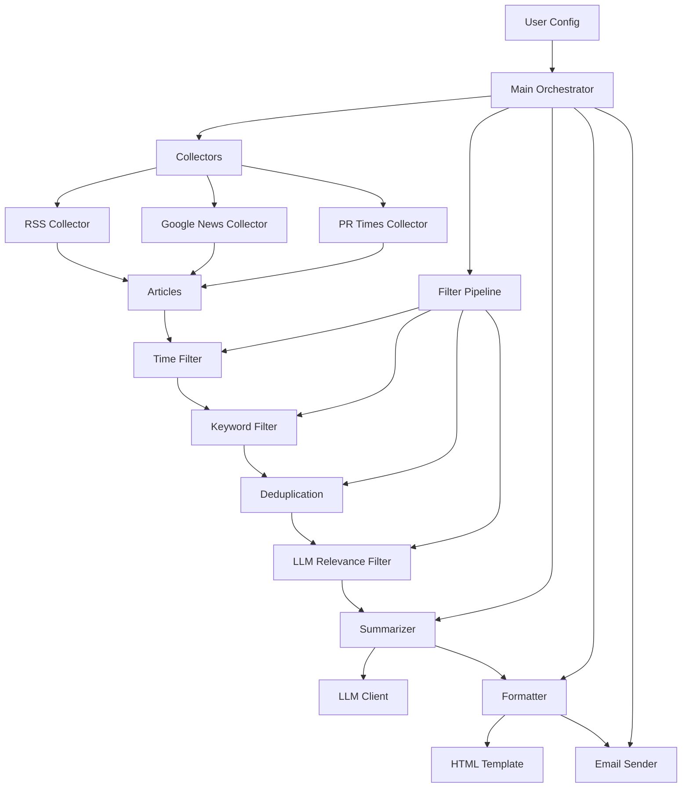

# Daily Brief - Global Finance & Japan Industry Newsletter

[](https://opensource.org/licenses/MIT)
[](https://www.python.org/downloads/)
[](https://platform.openai.com/)

A Python project that collects finance news from configurable RSS and Google News sources, filters by relevance using keyword matching and LLM scoring, summarizes with an LLM, compiles into a professional business newsletter HTML email, and sends via Resend.

## ✨ Features

- **Multi-source collection**: RSS feeds, Google News, and PR Times Japan
- **Intelligent filtering**: Time-based, keyword matching, deduplication, and LLM relevance scoring
- **AI-powered summarization**: Individual article summaries and executive summaries per topic
- **Professional HTML newsletter**: Clean, responsive email template
- **Configurable topics**: Easy-to-modify YAML configuration
- **Multi-language support**: English and Japanese content handling
- **Fallback mechanisms**: Broaden search when insufficient articles found
- **Error handling**: Graceful degradation when services fail

## 🚀 Quick Start

### Prerequisites

- Python 3.8+
- API keys for DashScope and Resend

### Installation

1. Clone the repository:
   ```bash
   git clone https://github.com/yourusername/daily-brief.git
   cd daily-brief
   ```

2. Create a virtual environment:
   ```bash
   python -m venv venv
   source venv/bin/activate  # On Windows: venv\Scripts\activate
   ```

3. Install dependencies:
   ```bash
   pip install -r requirements.txt
   ```

4. Copy the example environment file:
   ```bash
   cp .env.example .env
   ```

5. Update the `.env` file with your API keys and email:
   ```bash
   DASHSCOPE_API_KEY=your_dashscope_api_key_here
   RESEND_API_KEY=your_resend_api_key_here
   USER_EMAIL=your_email@example.com
   ```

6. Update the configuration file in `config/user_likaiwen.yaml` as needed

### Usage

- Run the full newsletter: `python main.py`
- Dry run (save to output folder): `python main.py --dry-run`
- Run single topic: `python main.py --topic "US Federal Reserve"`
- Run single category: `python main.py --category "Equity Markets & Crises"`

## 🏗️ Architecture Overview



## 🧠 Model Selection Rationale

- **Relevance scoring model**: `qwen3-coder-plus` - Used for high-volume, structured relevance scoring with JSON output
- **Summarization model**: `kimi-k2.5` - Used for higher quality writing for per-article and executive summaries
- **API compatibility**: OpenAI-compatible via Alibaba DashScope

## ⚙️ Configuration

The system is configured via `config/user_likaiwen.yaml`. The configuration includes:

- **Categories**: Top-level groupings (e.g., "Macro-Economic Policy & Central Banks")
- **Topics**: Specific subjects within categories (e.g., "US Federal Reserve")
- **Sources**: RSS feeds, Google News queries, or PR Times company keywords
- **Keywords**: Terms to match for relevance
- **Thresholds**: Minimum relevance scores for inclusion

## 🛡️ Error Handling

- Source fetch failure: Logs warning, continues with remaining sources
- LLM call failure: Falls back to keyword-only filtering (skips relevance scoring)
- Resend failure: Saves newsletter HTML to `output/` directory as fallback
- All errors logged to `logs/daily_brief.log` with rotation

## 🚧 Roadmap

- **Phase 2**: Authenticated full-text scraping for Nikkei and Financial Times
- **Phase 3**: Multi-user support with personalized configurations
- **Phase 4**: Advanced analytics and recommendation engine
- **Phase 5**: Mobile app for iOS and Android

## 🤝 Contributing

We welcome contributions! Please see our [CONTRIBUTING.md](CONTRIBUTING.md) for details on how to get started.

## 📜 License

This project is licensed under the MIT License - see the [LICENSE](LICENSE) file for details.

## 🙏 Acknowledgments

- Thanks to Alibaba DashScope for the LLM APIs
- Thanks to Resend for the email delivery service
- Thanks to the open-source community for the libraries used in this project