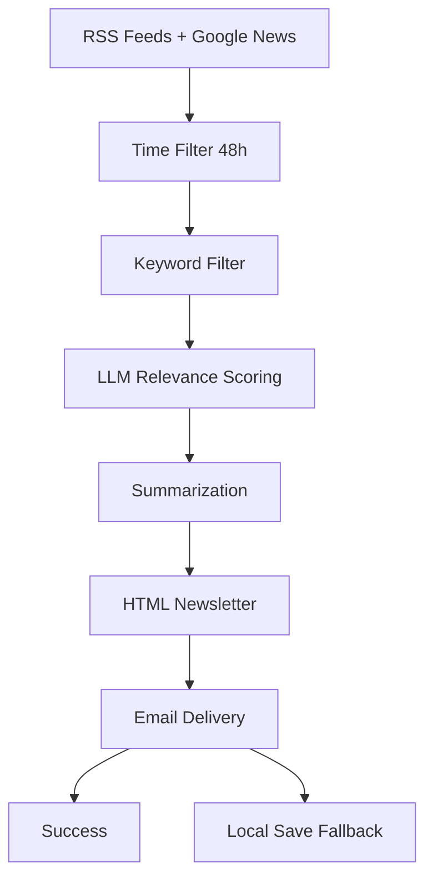

# Daily Brief — Personalized Finance Newsletter

AI-powered daily newsletter that collects, filters, and summarizes financial news from RSS feeds and Google News, then delivers a professional HTML newsletter via email.

Currently configured as a pilot tracking **Japan Interest Rate / BOJ monetary policy** news in both English and Japanese.

## How It Works



- Collectors fetch from RSS and Google News RSS
- Time filter discards articles older than 48 hours (configurable via --hours flag)
- Keyword filter matches article title + summary against topic keywords
- LLM relevance scoring (qwen3-coder-plus via DashScope) rates each article 0-10
- Summarization (kimi-k2.5 via DashScope) generates per-article and executive summaries
- Formatter renders a Jinja2 HTML template
- Delivery sends via Resend (falls back to local HTML save on failure)

## Project Structure

```
daily_brief/
├── config/                    # Configuration files
│   └── user_likaiwen.yaml     # Topic, category, and source configuration
├── collectors/               # Data collection modules
│   ├── base.py               # Base collector interface
│   ├── rss_collector.py      # RSS/Atom feed collector
│   ├── google_news_collector.py # Google News collector
│   └── prtimes_collector.py  # PR Times collector
├── filters/                  # Article filtering modules
│   ├── time_filter.py        # Time-based filtering
│   ├── keyword_filter.py     # Keyword matching filter
│   ├── dedup.py              # Duplicate removal
│   └── llm_relevance.py      # LLM-based relevance scoring
├── summarizer/               # Content summarization
│   └── summarizer.py         # Article and topic summarization
├── formatter/                # Newsletter formatting
│   └── newsletter.py         # HTML template renderer
├── templates/                # HTML templates
│   └── newsletter.html       # Main newsletter template
├── delivery/                 # Email delivery
│   └── email_sender.py       # Resend integration
├── utils/                    # Utility functions
│   └── llm_client.py         # LLM API client
├── models.py                 # Data models (Article, TopicConfig, etc.)
├── main.py                   # Main orchestrator
├── requirements.txt          # Python dependencies
├── .env.example             # Environment variable template
├── .gitignore               # Git ignore rules
├── LICENSE                  # MIT License
├── README.md                # This file
└── output/                  # Generated newsletters (local backup)
```

## Setup

### Prerequisites
- Python 3.10+
- Alibaba DashScope API key (coding plan — supports qwen3-coder-plus and kimi-k2.5)
- Resend API key

### Installation
1. Clone the repo
2. `pip install -r requirements.txt`
3. Copy `.env.example` to `.env` and fill in your keys
4. Edit `config/user_likaiwen.yaml` to set your preferences

### Quick Start
```bash
python main.py --dry-run        # preview newsletter locally
python main.py                  # send newsletter via email
python main.py --hours 72       # extend lookback window
```

## Configuration Guide

### User Config (config/user_likaiwen.yaml)
The YAML configuration defines categories containing topics, each with sources and keywords:
- Categories: Top-level groupings (e.g., "Japan Monetary Policy")
- Topics: Specific subjects within categories (e.g., "Japan Interest Rate")
- Sources: RSS feeds and Google News queries to collect from
- Keywords: Terms to match for relevance (strict) and broad terms (require 2+ matches)
- Thresholds: Minimum relevance scores for inclusion

### Adding a New Topic
Step-by-step:
1. Add a new topic block under the appropriate category
2. Define keywords (strict terms that uniquely identify the topic)
3. Add keywords_broad if needed (common terms that need 2+ matches)
4. Add sources (RSS feeds and/or Google News queries)
5. Set llm_relevance_threshold (start at 5, raise if too noisy, lower if too quiet)
6. Test with: `python main.py --dry-run --topic "Your Topic Name"`

### Adding a New RSS Feed
1. Verify the feed URL returns valid XML: `curl -s "URL" | head -20`
2. Add to the topic's sources list in the YAML
3. Test with a dry run

### Adding Email Recipients
Currently single-user. To add recipients:
1. The USER_EMAIL env var supports one address
2. To send to multiple addresses, modify delivery/email_sender.py to accept a list
3. For multi-user with different topic preferences, create additional YAML configs

### Scaling to Multiple Topics
The pilot runs 1 topic with 4 sources. The architecture supports many more:
- The original design included 12 topics across 5 categories
- Each topic adds ~100-300 LLM tokens for relevance scoring per article
- A 12-topic config with ~50 articles each costs roughly 200-300K tokens per run
- Add topics incrementally and test each one before going live

## Setting Up Daily Automation (macOS)

### Option A: Calendar Reminder + Shell Script
1. Create run.sh in the project root:
   ```bash
   #!/bin/bash
   cd /path/to/daily_brief
   /usr/bin/python3 main.py >> logs/cron.log 2>&1
   ```
2. `chmod +x run.sh`
3. Open macOS Calendar, create a daily recurring event at your desired time
4. In the event's Alert settings, choose "Open file" and select run.sh
5. The newsletter will be generated and emailed at that time each day

### Option B: launchd (more reliable)
1. Create a plist file at ~/Library/LaunchAgents/com.dailybrief.plist
2. ```xml
   <?xml version="1.0" encoding="UTF-8"?>
   <!DOCTYPE plist PUBLIC "-//Apple//DTD PLIST 1.0//EN" "http://www.apple.com/DTDs/PropertyList-1.0.dtd">
   <plist version="1.0">
   <dict>
       <key>Label</key>
       <string>com.dailybrief</string>
       <key>ProgramArguments</key>
       <array>
           <string>/usr/bin/python3</string>
           <string>/path/to/daily_brief/main.py</string>
       </array>
       <key>StartCalendarInterval</key>
       <dict>
           <key>Hour</key>
           <integer>8</integer>
           <key>Minute</key>
           <integer>0</integer>
       </dict>
       <key>StandardOutPath</key>
       <string>/path/to/daily_brief/logs/daily_brief.log</string>
       <key>StandardErrorPath</key>
       <string>/path/to/daily_brief/logs/daily_brief_error.log</string>
   </dict>
   </plist>
   ```
3. Load with: `launchctl load ~/Library/LaunchAgents/com.dailybrief.plist`
4. This runs even without Calendar.app open

## Roadmap
- [ ] Phase 2: Authenticated scraping for Nikkei and Financial Times full-text access
- [ ] Multi-user support with per-user YAML configs
- [ ] Weekly digest mode (aggregate week's top stories)
- [ ] --since flag to override lookback window for catching up after weekends
- [ ] Web dashboard to preview and manage newsletter settings

## License
MIT